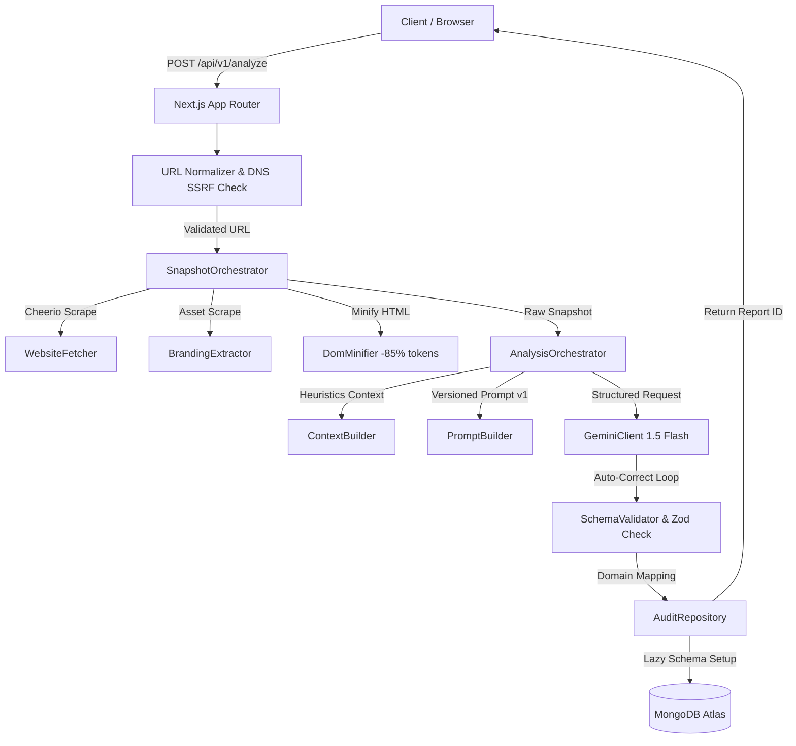

# 🚀 Shopify CRO Opportunity Engine

> **AI-powered Conversion Rate Optimization (CRO) audits for Shopify storefronts — in under 30 seconds.**

[](https://www.typescriptlang.org)
[](https://nextjs.org)
[](https://tailwindcss.com)
[](https://opensource.org/licenses/MIT)

---

## 📖 Overview

The **Shopify CRO Opportunity Engine** is a high-performance SaaS auditing platform. It crawls any public Shopify storefront, extracts structural elements, CTAs, headings, product page layouts, and branded styling, then feeds them into a multi-stage **Gemini 1.5 Flash AI Pipeline**. It yields structured, action-oriented conversion optimization recommendations categorized by page type, impact matrix, and developer implementation effort.

---

## ⚡ Features

| Feature | Engineering & Business Value |
| :--- | :--- |
| 🕷️ **Optimized DOM Scraper** | Axios + Cheerio crawler with a custom HTML-minification pipeline. Discards styles, scripts, and media attributes to reduce prompt tokens by **~85%**. |
| 🧠 **Structured Gemini Pipeline** | Strict structured JSON outputs via Gemini 1.5 Flash. Integrated Zod schema verification and a self-correcting corrective prompt retry loop. |
| 🎨 **Automated Branding Extractor** | Parses storefronts to fetch, resolve, and normalize Favicons, Logo URLs, and Store Names for high-fidelity report customization. |
| 🛡️ **Network SSRF Protection** | Multi-tier validation: rejects RFC1918 private IP ranges, local loops, internal hostnames, and non-valid storefront subdomains. |
| 📊 **Segmented Page Scoring** | Calculates conversion quality scores for key funnel pages: **Homepage**, **Product Detail Page (PDP)**, **Collection**, and **Cart**. |
| 📱 **Stripe-grade Mobile PWA UI** | Stunning glassmorphic headers, responsive radial scores, compact checkbox cards, and single-line typography designed for premium mobile UX. |
| 💾 **MongoDB Atlas Repository** | Thread-safe connection pooling, index caching, and lazy auto-index generation to guarantee sub-millisecond retrieval. |

---

## 🏗️ Architecture Flow



---

## 📂 Project Structure

```
shopify-cro-opportunity-engine/
├── .github/workflows/        # Automated GitHub Actions CI pipeline
├── docs/                     # Engineering documentation and final metrics
│   ├── 01-prd.md             # Product Requirements Document
│   ├── 02-hld.md             # High-Level Architecture Design
│   ├── 09-engineering-decisions.md  # Core architectural tradeoffs
│   └── 15-final-metrics.md   # System performance stats
├── prompts/                  # System prompts versioning (v1.0.0)
├── public/assets/            # Branded logos, illustrations, and favicons
├── src/
│   ├── app/                  # Next.js App Router layout and pages
│   │   ├── api/v1/           # Scraper, analyzer, and database API endpoints
│   │   ├── audits/[id]/      # Beautiful interactive audit report details
│   │   ├── dashboard/        # Audit list with advanced search & filtering
│   │   └── page.tsx          # Real-time progress landing page
│   ├── components/           # Reusable atomic UI system components
│   ├── server/               # Enterprise domain logic services
│   │   ├── ai/               # Gemini client, context mapping, Zod schemas
│   │   ├── crawler/          # Fetchers & Cheerio scraping services
│   │   ├── db/               # MongoDB driver connection & repository
│   │   ├── errors/           # Custom AppError classes
│   │   ├── normalizer/       # URL validator and DNS resolver
│   │   └── snapshot/         # Unified branding and layout extractor
│   ├── styles/               # Tailwind CSS v4 directives and globals
│   └── utils/                # Lightweight helpers (cn, delay, retry)
└── types/                    # Domain models and TypeScript declarations
```

---

## 🚀 Quick Start

### Prerequisites

- **Node.js**: `v18.0.0` or higher
- **MongoDB**: Access to a MongoDB Atlas cluster ([Get free M0 tier](https://www.mongodb.com/cloud/atlas))
- **Gemini API Key**: Access token for Google Gemini ([Get free API Key](https://aistudio.google.com))

### 1. Installation

```bash
# Clone the repository
git clone https://github.com/RevanthKumar66/CRO-Engine.git
cd CRO-Engine

# Install dependencies
npm install

# Setup environment variables
cp .env.example .env
```

### 2. Configure Environment

Open `.env` and fill in your keys:

```env
# Required API Keys & Database Connections
GEMINI_API_KEY=your_google_gemini_api_key
MONGODB_URI=mongodb+srv://<username>:<password>@cluster.mongodb.net/cro-engine

# App URL Configuration
NEXT_PUBLIC_APP_URL=http://localhost:3000
```

### 3. Running Scripts

```bash
# Run local development server
npm run dev

# Run test suites (Vitest unit & integration tests)
npm run test

# Check TypeScript compilations
npm run check-types

# Format files with Prettier
npm run format

# Build production bundle
npm run build
```

---

## 🔌 API Reference

| Endpoint | Method | Payload / Response | Description |
| :--- | :--- | :--- | :--- |
| `/api/v1/analyze` | `POST` | `{ "url": "https://store.com" }` | Starts DOM crawl and AI audit pipeline. |
| `/api/v1/audits` | `GET` | Returns list of all stored reports. | Paginated, searchable audit history list. |
| `/api/v1/audits/:id` | `GET` | Returns full `AuditReport` domain model. | Retrieves comprehensive audit details. |
| `/api/v1/health` | `GET` | `{ "status": "healthy" }` | Basic system health check. |

---

## 🛠️ Core Engineering Mechanics

### DOM Minification Pipeline
Raw Shopify HTML files frequently exceed **500KB**, which causes severe context window bloat and increased API cost. The crawler runs a custom HTML-stripping parser that removes scripts, stylesheets, inline styling, SVGs, and redundant parameters. The output is a highly minified layout structure (~15% of original size), delivering identical heuristic audit quality at a fraction of the cost.

### Gemini Self-Correction Loop
In order to enforce strict domain models, the prompt demands JSON response formatting matching a predefined Zod schema. If the output fails Zod parsing (e.g. truncated JSON or missing fields), the pipeline intercepts the error, wraps the failure logs into a corrective prompt, and retries up to 3 times automatically before returning a failure state.

---

## 📄 License

This project is licensed under the MIT License - see the [LICENSE](LICENSE) file for details.
