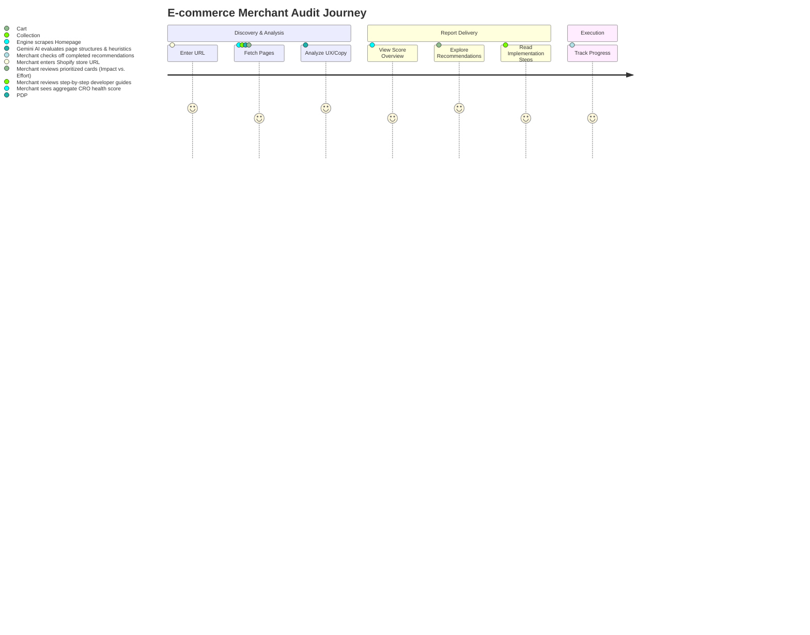

# Shopify CRO Opportunity Engine - Product Requirements Document (PRD)

## Vision
The **Shopify CRO Opportunity Engine** aims to democratize high-end Conversion Rate Optimization (CRO) for Shopify merchants. By leveraging Gemini AI's deep analytical reasoning, the platform automatically scans storefronts, evaluates user experience (UX) and marketing copy, and produces actionable, professional-grade CRO recommendation audits that merchants can implement to immediately increase store conversion rates and average order value (AOV).

---

## Problem Statement
Shopify merchants face a highly competitive e-commerce landscape. Traffic acquisition (ads, SEO) is increasingly expensive. However:
1. **High Agency Costs**: Hiring a professional CRO agency or UX consultant costs between $3,000 and $10,000+ per month, which is prohibitive for small and medium-sized businesses (SMBs).
2. **Generic Audit Tools**: Existing automated audit tools rely on static checklist rules (e.g., "Alt tag missing", "Page speed is slow") rather than understanding context, visual hierarchy, copywriting effectiveness, and e-commerce psychology.
3. **Data Overwhelm**: Merchants have access to Google Analytics or Shopify Analytics, but they struggle to translate raw numbers into specific interface modifications.

---

## Goals (In Scope)
* **Automated Storefront Parsing**: Extract visual structure, layout, typography, navigation, product presentation, CTA visibility, and copywriting from public Shopify storefront pages (Homepage, Collection Page, Product Detail Page, Cart Page).
* **Gemini AI Auditing**: Apply Gemini AI (1.5 Flash/Pro) with structured output formats to evaluate the store against established e-commerce CRO heuristics.
* **Structured Recommendations**: Generate granular, implementation-ready recommendations classified by impact, effort, and page type.
* **Interactive Dashboard**: A clean, minimal SaaS dashboard that displays store audit scores, categorized findings, and a checklist of recommended actions.
* **No-Install Operation**: No Shopify app installation or theme modification required for initial audits; it analyzes public storefront pages via URL scraping.

## Non-Goals (Out of Scope for MVP)
* **Automatic Theme Editing**: The tool will *not* write code directly into the merchant's Shopify theme.
* **Live A/B Testing**: The engine will not run split-tests in the merchant's live environment (planned for future phases).
* **General Web Audits**: The tool will specialize exclusively in Shopify-based e-commerce storefront architectures.

---

## Target Personas

| Persona | Role | Core Need | Key Friction |
| :--- | :--- | :--- | :--- |
| **Sarah (Solo Founder)** | Store Owner (SMB) | Wants to increase conversions with minimal spend. | No technical skills, budget is tight, doesn't know what layout tweaks are needed. |
| **Mark (Growth Marketer)** | Digital Marketer (Mid-market) | Needs quick optimization ideas to lower acquisition costs. | Spends too much time manual-auditing; needs data-backed suggestions to present to developers. |
| **Dave (Agency Dev)** | Freelance Shopify Dev | Wants to pitch CRO improvements to existing clients. | Needs structured reports to justify contract extensions. |

---

## User Journey Map

---

## Functional Requirements

### 1. Storefront Scraper and Metadata Extraction
* **FR-1.1**: The system must accept a public Shopify storefront URL.
* **FR-1.2**: The system must identify the site framework as Shopify (detecting common elements like `/products/`, `/collections/`, `Shopify.theme`, etc.).
* **FR-1.3**: The system must extract HTML metadata, DOM layout skeletons, heading hierarchies, copy, call-to-actions, form structures, navigation configurations, and speed markers.
* **FR-1.4**: The system must handle rate-limiting and user-agent restrictions gracefully, defaulting to clean text parsing when heavy scripts block traditional scrapers.

### 2. Gemini AI Analysis Engine
* **FR-2.1**: The system must parse storefront content using Gemini AI models (`gemini-1.5-flash` for speed, fallback to `gemini-1.5-pro` for deep reasoning).
* **FR-2.2**: The analysis must use structured JSON schemas to enforce outputs containing:
  - Global CRO Health Score (0-100)
  - Page-specific score breakdowns
  - Prioritized list of opportunities (Recommendations)
* **FR-2.3**: Recommendations must evaluate copywriting, structural layout, CTAs, Trust/Social Proof, Mobile responsiveness, and Checkout/Cart friction.
* **FR-2.4**: Each recommendation must specify:
  - Page Type (Homepage, PDP, Collection, Cart)
  - Finding description (the "What")
  - Psychological/CRO Rationale (the "Why")
  - Clear Action Steps (the "How")
  - Impact Level (High, Medium, Low)
  - Implementation Effort Level (High, Medium, Low)

### 3. Recommendation Dashboard
* **FR-3.1**: Display an overall CRO score using a visual radial gauge with distinct colors (Red/Yellow/Green thresholding).
* **FR-3.2**: Filter recommendations by **Page Type**, **Impact Level**, and **Effort Level**.
* **FR-3.3**: Render recommendations as expandable Cards, showing detailed execution steps, target page elements, and a mock/conceptual explanation of the target UI state.
* **FR-3.4**: Maintain a "Completed Checklist" where the user can mark recommendations as completed to visually track improvement.

---

## Non-Functional Requirements

### 1. Performance & Latency
* **NFR-1.1**: Scraping and extraction of public store pages must complete in under 5 seconds.
* **NFR-1.2**: Gemini AI structured reasoning and analysis must compile in under 12 seconds.
* **NFR-1.3**: Page transitions and filters on the client dashboard must render near-instantaneously (<100ms).

### 2. Scalability & Limits
* **NFR-2.1**: Scraper must process storefront sizes up to 100KB of clean parsed DOM layout text per page.
* **NFR-2.2**: The analysis pipeline must run asynchronously to prevent gateway timeouts.

### 3. Usability & Accessibility
* **NFR-3.1**: Fully responsive web design supporting viewports from 375px (Mobile-first) up to 1920px.
* **NFR-3.2**: AAA WCAG 2.1 compliance for text color contrasts, keyboard navigation, and screen readers.

---

## Success Metrics

| Metric | Target | Measurement Method |
| :--- | :--- | :--- |
| **Analysis Success Rate** | > 98% | Number of completed audits divided by total requests. |
| **Average Audit Latency** | < 15 seconds | Server timestamp delta from submit to UI display. |
| **Gemini JSON Compliance** | 100% | Percentage of AI queries that adhere strictly to schema without parsing failure. |
| **User Interaction Rate** | > 65% | Percentage of users who interact with filters or check off at least one checklist item. |

---

## Risks & Mitigation Strategies

* **Risk 1: Scraper Blocking (Cloudflare/Captchas)**
  - *Description*: Target Shopify stores protect their public pages using advanced WAFs.
  - *Mitigation*: Fallback to basic header impersonation, proxy rotations, and light DOM-only parsing (ignoring external tracking scripts).
* **Risk 2: Gemini API Latency or Context Limits**
  - *Description*: Store text is too large or Gemini API experiences sudden latency spikes.
  - *Mitigation*: Minify parsed HTML (strip scripts, styles, duplicate structural grids). Use strict timeouts and retry with backoff.

---

## Future Scope (Post-MVP)
* **Self-Healing Integrations**: Direct Shopify Admin API hook to push recommendation configurations automatically as theme blocks.
* **Continuous Monitoring**: Run weekly automated store audits to alert merchants if theme updates or code shifts lower CRO scores.
* **Visual Diff Overlays**: A browser extension overlaying recommendations directly onto the merchant's live storefront.
