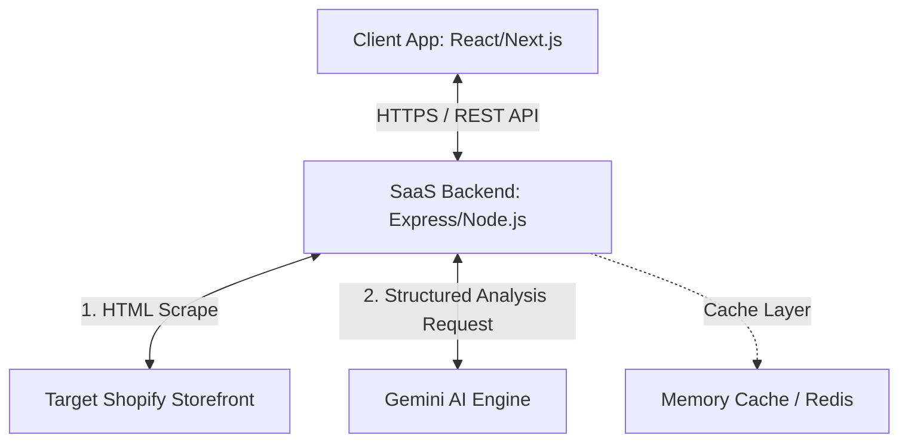
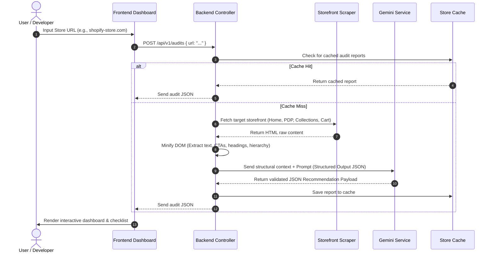

# Shopify CRO Opportunity Engine - High-Level Design (HLD)

## Architecture Overview
The Shopify CRO Opportunity Engine is built on a clean, decoupled architecture consisting of an **Interactive Frontend** (built on Next.js/React or Single Page Application architecture) and a **Structured Node.js Backend API Service Layer**. The backend handles target storefront scraping, minification, prompt composition, Gemini API invocation, and validation.

---

## System Diagram & Data Flow

Below is the sequence diagram illustrating how a URL submitted by a client is processed, scraped, analyzed by Gemini AI, and returned as a structured response.

---

## Component Responsibilities

| Component | Responsibility | Technical Stack |
| :--- | :--- | :--- |
| **Client UI** | Render Dashboard overview, gauges, filterable cards, checkmark progress tracker, layout skeletons. | React, TypeScript, Vanilla CSS |
| **API Gateway / Router** | Route requests, validate inbound payloads, handle rate-limiting, and standard Express/Next.js API error mapping. | Express.js / Next.js API Routes |
| **Storefront Scraper** | Execute headless-light HTTP requests to fetch page sources. Handles storefront platform detection and basic fallback scraping. | Axios / Cheerio |
| **DOM Processor** | Strip redundant CSS/JS, extract headers, anchor lists, form parameters, structural headings, and content text to feed Gemini. | Custom JS Utility |
| **Gemini AI Service** | Compose system prompt instructions, establish validation parameters, handle safety controls, and parse JSON response payload. | Google Gen AI SDK (`@google/genai`) |
| **Cache Layer** | Store generated audit payloads temporarily to prevent redundant AI queries and scraper blockages. | Memory Cache / Redis |

---

## External Services
1. **Google Gemini API**: Utilizes `gemini-1.5-flash` for high-throughput, structured extraction and heuristic checks. Fallbacks to `gemini-1.5-pro` for stores with heavy textual content or complex structure.
2. **Shopify CDN (Verification)**: Implicit connection during storefront crawling to analyze stylesheet structure and theme-specific assets (e.g., detecting Shopify-specific stylesheet directories).

---

## Security
* **Data Privacy**: The scraper only fetches publicly accessible storefront HTML documents. No credentials, access tokens, or private customer databases are ever queried.
* **Content Security Policy (CSP)**: Strict headers to ensure client application code does not load third-party unauthorized scripting.
* **Input Sanitization**: Storefront URLs are thoroughly sanitized to prevent SSRF (Server-Side Request Forgery) attacks where a user enters an internal network IP (e.g., `127.0.0.1` or `169.254.169.254`).
* **API Rate Limiting**: Limit audits per IP address to avoid API key abuse.

---

## Performance & Optimization
* **DOM Compression**: Raw HTML is trimmed to a skeletal structural representation. Script blocks (`<script>`), styling tags (`<style>`), and inline SVG data are discarded before sending the content payload to Gemini. This reduces token consumption by up to 85%.
* **Asynchronous Execution Flow**: The client UI shows progressive loading skeletons during the 10-15 seconds analysis window to maintain high perceived responsiveness.

---

## Deployment & Scalability Overview
* **Serverless / Container-based Execution**: The Node.js API layer is deployed to a serverless platform (e.g., Vercel, AWS Lambda) or a containerized system (e.g., Docker, fly.io) to support auto-scaling under peak request periods.
* **Cold Start Optimization**: The scraping package and Gemini SDK are minified and packaged together using a bundler (e.g., esbuild) to minimize startup overhead.
