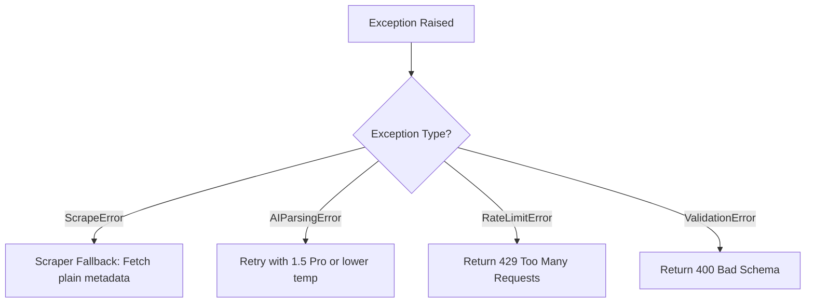

# Shopify CRO Opportunity Engine - Low-Level Design (LLD)

## Directory Layout & Module Structure

The application follows clean coding principles with strict boundaries between layers.

```text
src/
├── core/
│   ├── errors/
│   │   ├── app-error.ts         # Base application error
│   │   └── error-codes.ts       # Enum of standardized code values
│   ├── config.ts                # Application environmental variables
│   └── constants.ts             # Domain constants (heuristics, rate limits)
├── features/
│   ├── scraper/
│   │   ├── storefront-scraper.ts# Cheerio-based fetcher and parser
│   │   ├── dom-minifier.ts      # HTML compressor (stripping scripts, CSS, SVGs)
│   │   └── page-extractor.ts    # Extracting CTA lists, headers, copy elements
│   ├── analysis/
│   │   ├── gemini-service.ts    # SDK wrapper for Gemini models
│   │   ├── schema-definitions.ts# Structured output JSON schema maps
│   │   └── audit-processor.ts   # Core orchestrator coordinating scraping + AI
│   └── dashboard/
│       ├── types.ts             # Interface representations for Dashboard UI
│       └── formatters.ts        # Conversions from raw AI to UI display shapes
└── server/
    ├── middleware/
    │   ├── error-handler.ts     # Express global error catcher
    │   └── rate-limiter.ts      # Rate limiter middleware
    └── index.ts                 # Express entry-point / server wrapper
```

---

## Module Designs

### 1. Storefront Scraper and DOM Minifier (Extraction Layer)
* **Goal**: Fetch public Shopify pages and minify their content to fit within token boundaries.
* **Algorithm**:
  1. Make a `GET` request using Axios with custom headers mimicking a standard modern browser.
  2. Load content into a Cheerio DOM tree.
  3. Traverse tree and remove: `script`, `style`, `svg`, `iframe`, `noscript`, and common tracking pixels tags.
  4. Extract:
     - All headings (`h1`, `h2`, `h3`) with text.
     - Anchors with text content and visual class details (to assess button placement and CTAs).
     - Product detail attributes if present (price container, add to cart container).
     - Text content length and structural outlines.

### 2. Gemini AI Client Service (AI & Prompt Layer)
* **Goal**: Interface with Google Gen AI SDK safely, enforcing JSON Schema outputs.
* **Configuration**:
  - Model: `gemini-1.5-flash` (standard), fallback to `gemini-1.5-pro` upon response token overflow.
  - Temperature: `0.2` (to ensure predictable, highly logical evaluations instead of creative hallucinations).
  - Response MIME Type: `application/json`.
  - Response Schema: Standard JSON Schema enforcing exact output structures.

### 3. Validation Layer
* **Goal**: Validate inputs (storefront URLs) and outputs (Gemini API results).
* **Zod Schemas**:
  - `StorefrontUrlSchema`: Validates that URL is absolute, has a public TLD, does not match local/private ranges.
  - `AuditResponseSchema`: Validates that the AI's JSON return structure conforms perfectly to the required application formats (scores, findings, recommendations).

---

## Type Interfaces (`types/index.d.ts`)

Here are the central TypeScript interface contracts:

```typescript
export type TargetPageType = 'homepage' | 'pdp' | 'collection' | 'cart';
export type ImpactLevel = 'HIGH' | 'MEDIUM' | 'LOW';
export type EffortLevel = 'HIGH' | 'MEDIUM' | 'LOW';

export interface StorefrontMetadata {
  url: string;
  detectedPlatform: 'shopify' | 'unknown';
  headings: Array<{ tag: string; text: string }>;
  ctas: Array<{ label: string; href: string; classes: string }>;
  rawContentSnippet: string;
}

export interface Recommendation {
  id: string;
  pageType: TargetPageType;
  category: 'copywriting' | 'layout' | 'cta' | 'trust' | 'mobile' | 'performance';
  finding: string;
  rationale: string;
  actionSteps: string[];
  impact: ImpactLevel;
  effort: EffortLevel;
}

export interface AuditReport {
  id: string;
  storeUrl: string;
  overallScore: number;
  analyzedAt: string;
  pageScores: {
    homepage: number;
    pdp: number;
    collection: number;
    cart: number;
  };
  recommendations: Recommendation[];
}

export interface ApiResponse<T> {
  success: boolean;
  data?: T;
  error?: {
    code: string;
    message: string;
    details?: any;
  };
}
```

---

## Error Handling Framework



### Error Codes Definition

```typescript
export enum ErrorCodes {
  INVALID_URL = 'ERR_INVALID_URL',
  SCRAPING_FAILED = 'ERR_SCRAPING_FAILED',
  NOT_SHOPIFY_STORE = 'ERR_NOT_SHOPIFY_STORE',
  AI_PROCESSING_ERROR = 'ERR_AI_PROCESSING_ERROR',
  AI_VALIDATION_FAILED = 'ERR_AI_VALIDATION_FAILED',
  RATE_LIMIT_EXCEEDED = 'ERR_RATE_LIMIT_EXCEEDED',
  INTERNAL_SERVER_ERROR = 'ERR_INTERNAL_SERVER_ERROR',
}
```

### Application Error Base class
```typescript
export class AppError extends Error {
  constructor(
    public readonly code: ErrorCodes,
    message: string,
    public readonly statusCode: number = 500,
    public readonly details: any = null
  ) {
    super(message);
    Object.setPrototypeOf(this, new.target.prototype);
  }
}
```

---

## External Dependencies

The third-party dependencies required for Sprint 1 are defined as follows:

| Dependency | Purpose | Version Spec |
| :--- | :--- | :--- |
| **typescript** | Language compilation and static checking | `^5.0.0` |
| **@google/genai** | Official Google Gen AI API integration | `^0.1.0` |
| **axios** | Light HTTP client for storefront scraping | `^1.6.0` |
| **cheerio** | jQuery-style DOM processor for HTML minification | `^1.0.0-rc.12` |
| **zod** | Schema validation for API payloads and configuration | `^3.22.0` |
| **express** | Core API backend server framework | `^4.18.0` |
| **cors** | Cross-Origin resource sharing management | `^2.8.5` |
| **dotenv** | Environment configuration management | `^16.3.0` |
