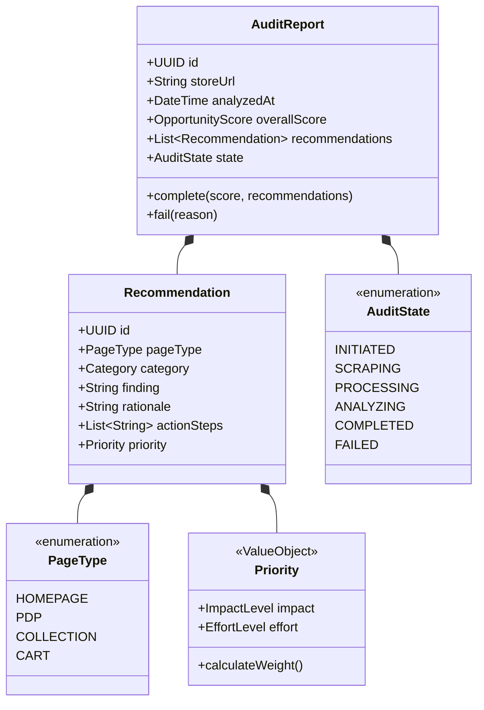
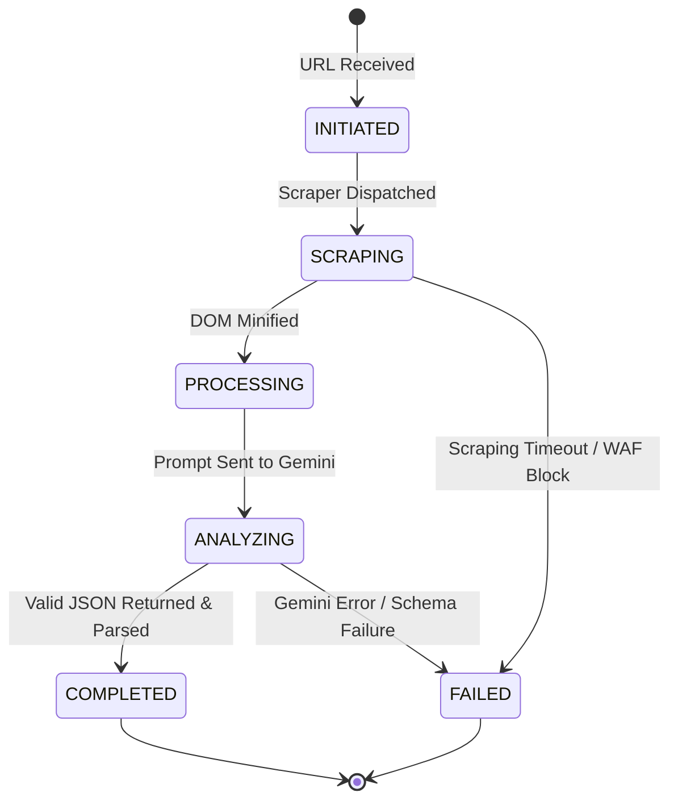

# Shopify CRO Opportunity Engine - Domain Model

This document maps out the domain boundaries, entities, value objects, lifecycle flows, and core business rules following Domain-Driven Design (DDD) principles.

---

## Domain Boundaries & Ubiquitous Language

* **Storefront**: The public-facing Shopify website pages accessible without authentication.
* **Audit**: The complete process of scanning a storefront, evaluating pages, and outputting optimization opportunities.
* **Audit Report**: The immutable data record containing scores, page summaries, and recommendations.
* **Recommendation**: A structured opportunity explaining how and why a merchant should modify a specific UI element to increase conversions.
* **CRO Heuristic**: Rules of e-commerce usability psychology against which storefront assets are checked.

---

## Entities & Value Objects (UML Model representation)

---

## Audit Report Lifecycle & State Transitions

An audit undergoes strict state transitions during its execution pipeline. State transitions must be transactional and error-resilient.

### State Definitions & Rules

1. **INITIATED**: The request is validated for URL formats. Rate limit slots are allocated.
2. **SCRAPING**: Network requests are executing to retrieve e-commerce HTML templates.
3. **PROCESSING**: The system extracts structural markup, minifies files, and formats raw text into a context token frame.
4. **ANALYZING**: The context is evaluated by Gemini API. The thread is waiting on structured outputs.
5. **COMPLETED**: The JSON response is verified, mapped to domain entities, saved to cache/DB, and returned to client.
6. **FAILED**: Terminal state containing error codes. Logs are created and rate limit slots can be refunded depending on issue type.

---

## Business Rules

### 1. Storefront Validation Rule (BR-101)
A URL is rejected as "not a valid Shopify storefront" unless it contains at least two of the following markers in its public homepage HTML structure:
- Script or link elements containing `cdn.shopify.com`.
- A global JavaScript variable declaring `Shopify.shop` or `Shopify.theme`.
- Form paths posting to `/cart/add` or `/search`.
- Structured product JSON matches containing `/products/` schemas.

### 2. Opportunity Priority Matrix (BR-102)
Each recommendation's UI priority is computed based on its Impact vs. Effort. High Impact and Low Effort recommendations are labeled as "Quick Wins" and pinned to the top of the dashboard checklist.

| Impact | Effort | Priority Level / Classification |
| :--- | :--- | :--- |
| **HIGH** | **LOW** | **Quick Win** (Critical - Priority 1) |
| **HIGH** | **MEDIUM** | **High Priority** (Priority 2) |
| **HIGH** | **HIGH** | **Strategic Goal** (Priority 3) |
| **MEDIUM** | **LOW** | **Nice to Have** (Priority 4) |
| **LOW** | **HIGH** | **De-prioritized** (Do Not Show in Dashboard) |

### 3. Score Heuristic Limits (BR-103)
Global and page scores are absolute integer boundaries:
- Must fall between `0` and `100`.
- Scores cannot be calculated if more than two target pages fail to scrape. In that case, the overall state transitions to `FAILED`.
