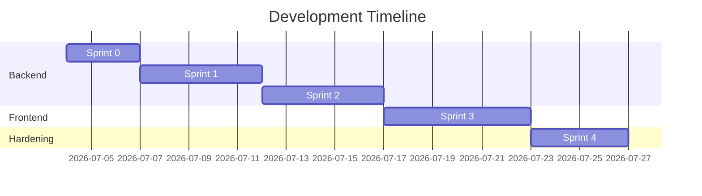

# Shopify CRO Opportunity Engine - Development Roadmap

This document outlines the milestones, sprint plans, deliverables, and acceptance criteria required to build the platform from the ground up, starting from Sprint 0.

---

## Roadmap at a Glance

---

## Detailed Sprint Plan

### Sprint 0: Repository Foundation (Current Sprint)
* **Goal**: Establish the codebase structure, document design architecture, and setup CI scaffolding.
* **Deliverables**:
  - Full documentation suites in `docs/`.
  - Directory folder structure created.
  - TypeScript types declaration (`types/index.d.ts`).
  - Standard linting, configuration, and CI workflows.
* **Acceptance Criteria**:
  - All target folders exist.
  - Every markdown planning document is fully written without placeholders.
  - Basic CI script checks successfully pass.

### Sprint 1: Scraper & DOM Extraction Engine
* **Goal**: Build the light scraper service to download and minify Shopify public storefront HTML pages.
* **Deliverables**:
  - `storefront-scraper.ts` to perform network crawls.
  - `dom-minifier.ts` to compress target pages (removing scripts, CSS, SVGs, etc.).
  - Automated tests validating the scraper logic against mock HTML sources.
* **Acceptance Criteria**:
  - Able to scrape homepage, product detail, collection, and cart pages.
  - HTML content minified to clean DOM representation under 80% original size.
  - Correctly flags stores that are not hosted on Shopify.

### Sprint 2: Gemini AI Integration & Schema Validation
* **Goal**: Connect to the Gemini API, feed minified store data, and parse structured CRO recommendations.
* **Deliverables**:
  - `gemini-service.ts` containing API connections and temperature overrides.
  - JSON schemas mapping scores and recommendations.
  - Zod validation middleware parsing AI outputs.
* **Acceptance Criteria**:
  - API correctly returns a structured JSON payload conforming to `AuditReport` schema.
  - Safe error recovery for token boundary limits and invalid model responses.
  - Core scoring algorithms generate overall and page-specific e-commerce metrics.

### Sprint 3: Interactive Dashboard UI (Minimal SaaS)
* **Goal**: Code the interactive client dashboard utilizing the established design tokens.
* **Deliverables**:
  - Dashboard component mapping overall score gauges.
  - Filterable card views displaying recommendations (Page Type, Impact, Effort).
  - Progress tracker checklist.
  - Responsive layout skeletons (mobile-first views).
* **Acceptance Criteria**:
  - Screen looks visual premium, conforming to glassmorphism styles and color overrides.
  - Checklist states persist throughout page sessions.
  - Layout matches WCAG contrast ratios and keyboard requirements.

### Sprint 4: Hardening, Security, and Polish
* **Goal**: Implement server security guidelines, API rate-limiting, error mapping, and prepare for production deployment.
* **Deliverables**:
  - Custom Express error handling middleware.
  - Rate limiting logic to protect against API key abuse.
  - End-to-end local validation checks.
* **Acceptance Criteria**:
  - Server successfully catches internal errors and converts to generic JSON responses.
  - Scraper validated as secure against SSRF attacks.
  - API correctly handles up to 5 concurrent audits with robust execution.
