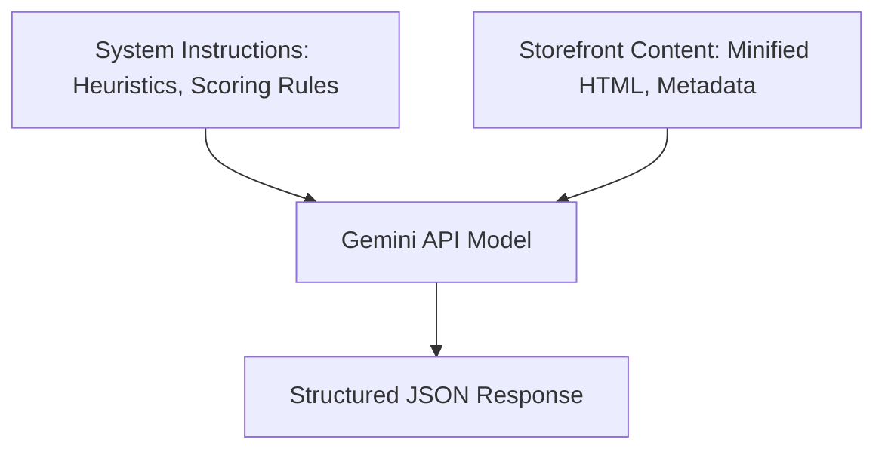
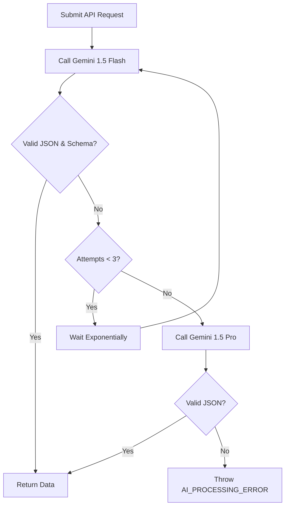

# Shopify CRO Opportunity Engine - AI Design

This document details the integration, prompt architecture, response verification, schema formatting, and retry strategies for the **Google Gemini API** integration.

---

## 1. Gemini Integration Overview
* **SDK**: `@google/genai` (Official Node.js SDK)
* **Default Model**: `gemini-1.5-flash`
* **Fallback Model**: `gemini-1.5-pro`
* **Temperature**: `0.2` (low temperature ensures focus, logical rigor, and minimizes hallucinations)
* **Response Format**: `application/json` with strict schema validation.

---

## 2. Prompt Architecture

To ensure high-quality and consistent recommendations, the prompts are divided into distinct parts: **System Instructions**, **Context Input**, and **Heuristic Guidelines**.



### Prompt Versioning
Prompts are stored inside version-controlled files under `prompts/system_prompts/v1.txt` and `prompts/templates/analysis_template.txt`. This separates the prompt lifecycle from application code changes.

---

## 3. Structured Output & JSON Schema

The Gemini API is configured with a strict response schema definition. Below is the JSON schema structure passed directly during model generation:

```json
{
  "type": "OBJECT",
  "properties": {
    "overallScore": {
      "type": "INTEGER",
      "description": "Global e-commerce CRO score from 0 to 100 based on parsed structures."
    },
    "pageScores": {
      "type": "OBJECT",
      "properties": {
        "homepage": { "type": "INTEGER" },
        "pdp": { "type": "INTEGER" },
        "collection": { "type": "INTEGER" },
        "cart": { "type": "INTEGER" }
      },
      "required": ["homepage", "pdp", "collection", "cart"]
    },
    "recommendations": {
      "type": "ARRAY",
      "items": {
        "type": "OBJECT",
        "properties": {
          "pageType": {
            "type": "STRING",
            "enum": ["homepage", "pdp", "collection", "cart"]
          },
          "category": {
            "type": "STRING",
            "enum": ["copywriting", "layout", "cta", "trust", "mobile", "performance"]
          },
          "finding": {
            "type": "STRING",
            "description": "Clear statement of the conversion friction or UX issue found."
          },
          "rationale": {
            "type": "STRING",
            "description": "The e-commerce psychology or CRO reasoning behind why this issue impacts conversions."
          },
          "actionSteps": {
            "type": "ARRAY",
            "items": { "type": "STRING" },
            "description": "Granular, actionable steps for a merchant or developer to fix the issue."
          },
          "impact": {
            "type": "STRING",
            "enum": ["HIGH", "MEDIUM", "LOW"]
          },
          "effort": {
            "type": "STRING",
            "enum": ["HIGH", "MEDIUM", "LOW"]
          }
        },
        "required": ["pageType", "category", "finding", "rationale", "actionSteps", "impact", "effort"]
      }
    }
  },
  "required": ["overallScore", "pageScores", "recommendations"]
}
```

---

## 4. API Invocation Code Pattern (SDK v1)

```typescript
import { GoogleGenAI, Type } from '@google/genai';
import { schemaDefinition } from './schema-definitions';

const ai = new GoogleGenAI({ apiKey: process.env.GEMINI_API_KEY });

export async function runStorefrontAnalysis(minifiedDOM: string, systemPrompt: string) {
  try {
    const response = await ai.models.generateContent({
      model: 'gemini-1.5-flash',
      contents: `Storefront data:\n${minifiedDOM}`,
      config: {
        systemInstruction: systemPrompt,
        temperature: 0.2,
        responseMimeType: 'application/json',
        responseSchema: schemaDefinition,
      }
    });

    const rawText = response.text();
    if (!rawText) {
      throw new Error('Empty response received from Gemini.');
    }
    return JSON.parse(rawText);
  } catch (error) {
    console.error('Gemini API Error:', error);
    throw error;
  }
}
```

---

## 5. Verification & Retry Strategy

To ensure high availability and prevent parsing errors in production:



* **Schema Validation**: The output is validated using Zod. If the Zod schema fails to parse the result, it is caught as a parsing error.
* **Exponential Backoff**: In the event of rate limits (HTTP 429), the system waits `base * factor^attempt` milliseconds before retrying.
* **Fallback Model Elevation**: If `gemini-1.5-flash` fails schema validation or times out twice, the request is automatically routed to `gemini-1.5-pro` to utilize its superior reasoning capabilities.

---

## 6. Safety Settings
We enforce standard safety filters to ensure external merchant storefront text does not trigger false positive blocks, while preventing prompt injection attempts.
- `HARM_CATEGORY_HARASSMENT`: Block low and above (to prevent malicious user scripts).
- `HARM_CATEGORY_HATE_SPEECH`: Block low and above.
- `HARM_CATEGORY_SEXUALLY_EXPLICIT`: Block low and above.
- `HARM_CATEGORY_DANGEROUS_CONTENT`: Block low and above.
